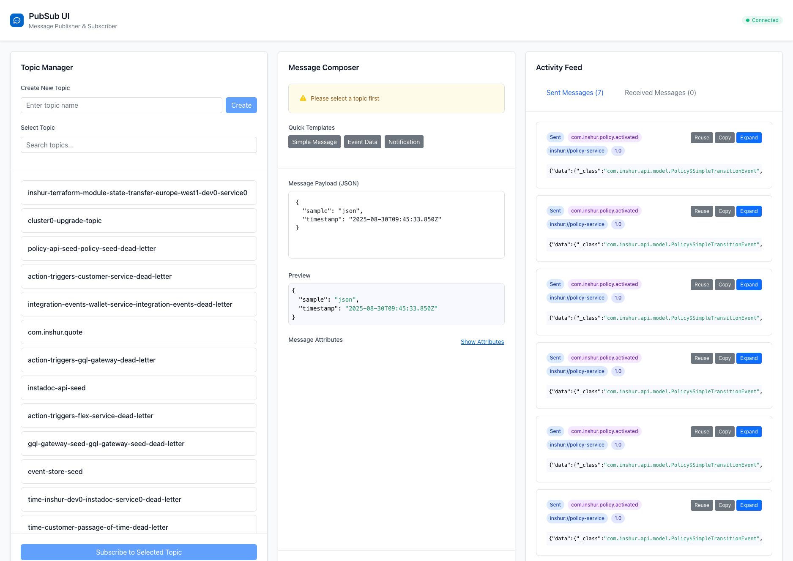

# PubSub UI



A modern web interface for Google Cloud Pub/Sub that simplifies topic management, message publishing, and activity monitoring. Built with Go and React, featuring an embedded UI and SQLite storage for message history.

## ✨ Features

- **Topic Management**: Create topics and browse existing ones with search functionality
- **Message Publishing**: Compose and send JSON messages with syntax highlighting and validation
- **Message Templates**: Quick templates for common message types (Simple Message, Event Data, Notification)
- **Activity Feed**: View sent and received messages with expandable details
- **Message History**: Reuse previously sent messages stored in SQLite
- **Real-time Updates**: Live connection status and message tracking
- **Clean UI**: Modern, responsive interface built with React and Tailwind CSS

## 🚀 Quick Start

### Prerequisites

- Go 1.19+
- Node.js 16+
- GCP Project ID

### Option 1: Local Development with Pub/Sub Emulator

1. **Start the Pub/Sub emulator** (in a separate terminal):
   ```bash
   gcloud beta emulators pubsub start --port=8681
   ```

2. **Build and run the application**:
   ```bash
   make local build=true
   ```

   This will:
   - Build the React UI
   - Start the Go server on `http://localhost:7979`
   - Connect to the Pub/Sub emulator at `localhost:8681`

### Option 2: Production with Real GCP Pub/Sub

```bash
make public PROJECT_ID=your-gcp-project-id build=true
```

Replace `your-gcp-project-id` with your actual GCP project ID.

## 🛠 Manual Setup

If you prefer to run commands separately:

1. **Build the React UI**:
   ```bash
   make build-ui
   ```

2. **Run the Go server**:
   ```bash
   # For local development with emulator
   cd services/api
   PROJECT_ID=your-project-id PUBSUB_EMULATOR_HOST=localhost:8681 PORT=7979 go run .
   
   # For production
   cd services/api
   PROJECT_ID=your-project-id PORT=7979 go run .
   ```

3. **Open your browser** to `http://localhost:7979`

## 📁 Project Structure

```
pubsub-ui/
├── services/api/           # Go backend server
│   ├── main.go            # Main server with embedded UI
│   ├── http/              # HTTP handlers
│   ├── commands/          # Business logic commands
│   ├── queries/           # Data queries
│   ├── models/            # Data models
│   ├── subscriptions/     # Pub/Sub subscription handling
│   └── ui/                # React frontend
│       ├── src/           # React source code
│       ├── build/         # Built UI (embedded in Go binary)
│       └── package.json   # Node.js dependencies
├── Makefile              # Build and run commands
└── README.md            # This file
```

## 🔧 Configuration

### Environment Variables

| Variable | Description | Required | Default |
|----------|-------------|----------|---------|
| `PROJECT_ID` | Your GCP Project ID | Yes | - |
| `PUBSUB_EMULATOR_HOST` | Pub/Sub emulator endpoint | No | Uses real GCP |
| `PORT` | Server port | No | `7979` |

### Database

The application automatically creates a SQLite database (`pubsubui.db`) to store message history. This allows you to:
- Reuse previously sent messages
- Track sent message history
- Maintain state between application restarts

## 🎯 Usage

1. **Create Topics**: Use the Topic Manager to create new Pub/Sub topics
2. **Select Topic**: Choose from existing topics in your project
3. **Compose Messages**: Write JSON messages using the editor with syntax highlighting
4. **Use Templates**: Quick-start with predefined message templates
5. **Send Messages**: Publish messages to selected topics
6. **View Activity**: Monitor sent and received messages in the activity feed
7. **Reuse Messages**: Click "Reuse" on any sent message to load it back into the composer

## 🏗 Architecture

- **Backend**: Go with Echo web framework
- **Frontend**: React with modern hooks and components
- **Styling**: Tailwind CSS for responsive design
- **Storage**: SQLite for local message persistence
- **Pub/Sub**: Google Cloud Pub/Sub SDK
- **Deployment**: Single binary with embedded UI assets

## 🤝 Contributing

This is an open-source project! Feel free to:

1. Fork the repository
2. Create a feature branch
3. Make your changes
4. Run tests and ensure the build works
5. Submit a pull request

### Development Commands

```bash
# Build UI only
make build-ui

# Run with local emulator
make local

# Run with real GCP (requires PROJECT_ID)
make public PROJECT_ID=your-project-id

# Run with fresh build
make local build=true
make public PROJECT_ID=your-project-id build=true
```

## 📝 License

This project is open source. See the repository for license details.
